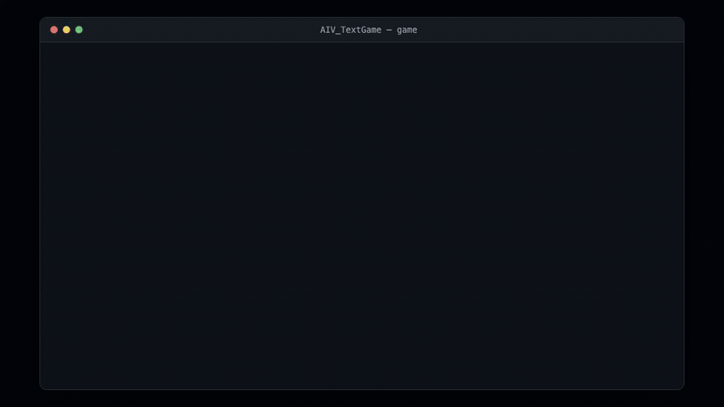

# AIV TextGame

A tiny turn-based text RPG in C++. Fight enemies one by one: each turn you
attack or heal, then the enemy hits back. Kill an enemy and you may grab a new
weapon. Win by clearing them all, lose if your HP hits zero.

## Demo



## Run

```bash
cmake -S . -B build && cmake --build build
./build/game
```
